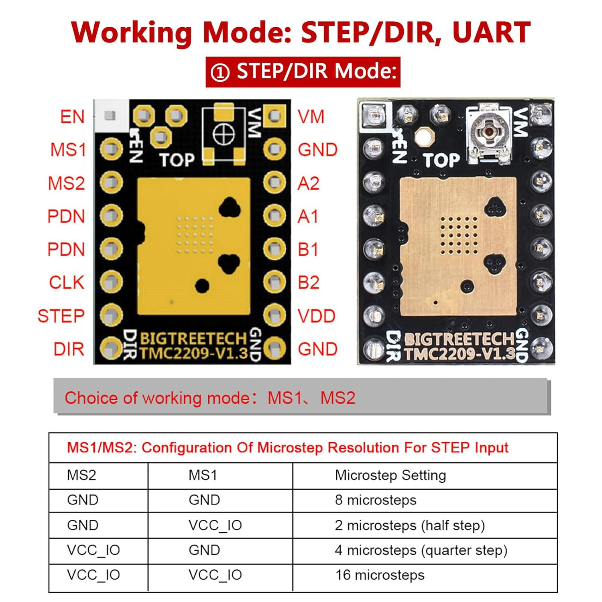
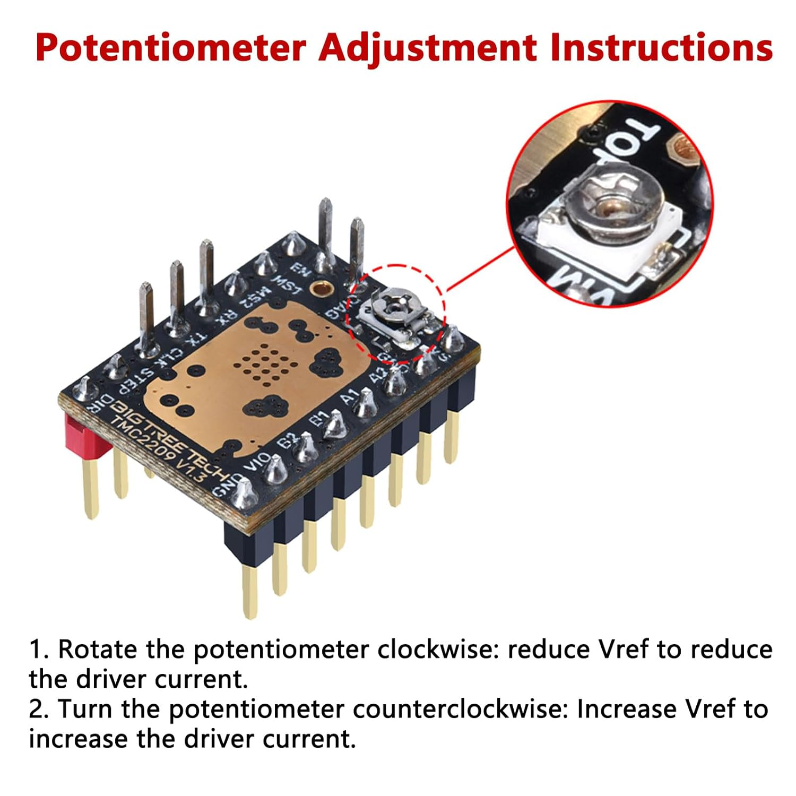
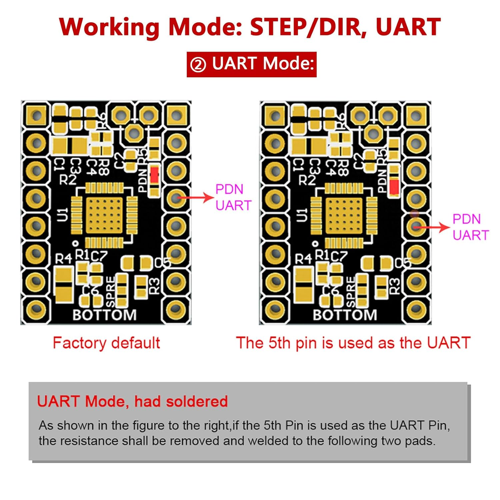

## Beschreibung

## **TMC2209 Schrittmotortreiber**  

**Ultra-leiser Treiber für präzise Motorsteuerung**  

### **Technische Highlights**  
- **Betriebsmodi**:  
  - STEP/DIR mit Hardware-Pin-Konfiguration 
  - UART-Schnittstelle für erweiterte Einstellungen 
- **Erkennungssysteme**:  
  - StallGuard4™ für lastabhängige Stall-Erkennung
  - SpreadCycle™ für hochdynamische Regelung
- **Kompatibilität**: Pin-kompatibel mit A4988/DRV8825

### **Anwendungsgebiete**  
✅ **3D-Drucker** (X/Y/Z-Achsen + Extruder) 
✅ **CNC-Fräsen** mit präziser Positionierung 
✅ **Büroautomatisierung** (Drucker, POS-Systeme) 
✅ **Sicherheitstechnik** (Kameras, Geldautomaten)

  

### Produktdetails (Bild 1)

* **Betriebsmodus:** STEP/DIR oder UART
* **Versorgungsspannung (VM):** 4.75V - 28V DC (Schrittmotor)
* **Spitzenstrom:** 2.8A
* **Dauerstrom (RMS):** 2A
* **Maximale Mikroschritte:** 256
* **Mikroschritteinstellung:** 2, 4, 8, 16 (kann in 256 unterteilt werden)
* **Leiser Betrieb**: StealthChop2™-Technologie für geräuscharmen Lauf

  

### Kühlung (Bild 2)

**Wichtige Hinweise:**

1.  **Einbaurichtung beachten:** Achte beim Einsetzen des Treibers in das Mainboard unbedingt auf die korrekte Ausrichtung. Ein falsches Einsetzen kann den Treiber dauerhaft beschädigen.
2.  **Ausreichende Kühlung sicherstellen:** Stelle sicher, dass der Treiber ausreichend gekühlt wird (z.B. durch einen Kühlkörper und/oder einen Lüfter), um eine Überhitzung und Fehlfunktionen zu vermeiden.

  

### Konfiguration der Mikroschritt-Auflösung (STEP/DIR Modus) (Bild 3)

Die TMC2209 Schrittmotortreiber ermöglichen die Einstellung verschiedener Mikroschritt-Auflösungen, wenn sie im STEP/DIR-Modus betrieben werden. Dies erlaubt eine feinere Steuerung der Motorposition und führt oft zu einem ruhigeren Lauf des Motors. Die Auswahl der Auflösung erfolgt durch die Beschaltung der Pins MS1 und MS2. Diese Pins können entweder mit GND (Masse) oder VCC_IO (der Logikspannung des Treibers, oft 3.3V oder 5V) verbunden werden. Die folgende Tabelle zeigt, welche Kombination von MS1 und MS2 zu welcher Mikroschritt-Einstellung führt. Eine höhere Anzahl von Mikroschritten bedeutet eine feinere Auflösung (z.B. 16 Mikroschritte pro Vollschritt des Motors).

| MS2    | MS1    | Mikroschritt-Einstellung      |
| :----- | :----- | :---------------------------- |
| GND    | GND    | 8 Mikroschritte               |
| GND    | VCC_IO | 2 Mikroschritte (Halbschritt) |
| VCC_IO | GND    | 4 Mikroschritte (Viertelschritt)|
| VCC_IO | VCC_IO | 16 Mikroschritte              |

**Hinweis:** Stellen Sie sicher, dass die Pins MS1 und MS2 entsprechend der gewünschten Auflösung korrekt verbunden sind, bevor der Treiber in Betrieb genommen wird. Die spezifischen Verbindungen (Jumper, Lötbrücken oder direkte Ansteuerung durch den Mikrocontroller) hängen vom Design des Boards ab, auf dem der TMC2209 eingesetzt wird.

  

### Treiberstrom Justierung (Bild 4)

Potentiometer zur Einstellung der Treiberstrom-Justierung. Die Anweisungen unterhalb des Bildes erklären, wie eine Drehung im Uhrzeigersinn den Vref-Wert und somit den Treiberstrom reduziert, während eine Drehung gegen den Uhrzeigersinn den Vref-Wert und den Treiberstrom erhöht.

  

### UART Modus Konfiguration (Bild 5)

Dieses Bild zeigt die Unterseite eines TMC2209 Stepper Motor Treibers und veranschaulicht die Konfiguration für den UART-Modus. Die linke Seite zeigt die Standardkonfiguration ab Werk. Die rechte Seite demonstriert, wie der 5. Pin für die UART-Kommunikation genutzt wird. Hierfür muss der Widerstand entfernt und an die zwei darunterliegenden Lötpunkte angelötet werden, wie im unteren Textfeld erklärt wird.

**Was ist der UART-Modus?**

Der UART-Modus (Universal Asynchronous Receiver/Transmitter) ist eine serielle Kommunikationsmethode, die es ermöglicht, Daten zwischen dem Stepper Motor Treiber und einer Steuerung (z.B. einem Mikrocontroller wie Arduino oder Raspberry Pi) über nur zwei Drähte (RX und TX) auszutauschen.

**Warum wird der UART-Modus verwendet?**

* **Erweiterte Steuerungsmöglichkeiten:** Im Gegensatz zur einfachen STEP/DIR-Ansteuerung ermöglicht der UART-Modus eine detailliertere und flexiblere Steuerung des Stepper Motors.
* **Konfiguration und Überwachung:** Über UART können Parameter des Treibers wie Mikroschrittauflösung, Stromlimit, Beschleunigung und andere Einstellungen direkt von der Steuerung aus konfiguriert und in Echtzeit überwacht werden.
* **Fehlererkennung und Rückmeldung:** Der Treiber kann über UART Statusinformationen und Fehlermeldungen an die Steuerung zurücksenden, was die Fehlersuche und Systemdiagnose erleichtert.
* **Weniger Pins erforderlich:** Für die Kommunikation sind nur zwei Datenleitungen notwendig, was im Vergleich zu anderen Kommunikationsprotokollen die Anzahl der benötigten Pins am Mikrocontroller reduziert.

Durch die Aktivierung des UART-Modus erhältst du also mehr Kontrolle über deinen Stepper Motor und kannst komplexere Bewegungsabläufe und Systeminteraktionen realisieren.

  

## ESP32 WROOM-32

